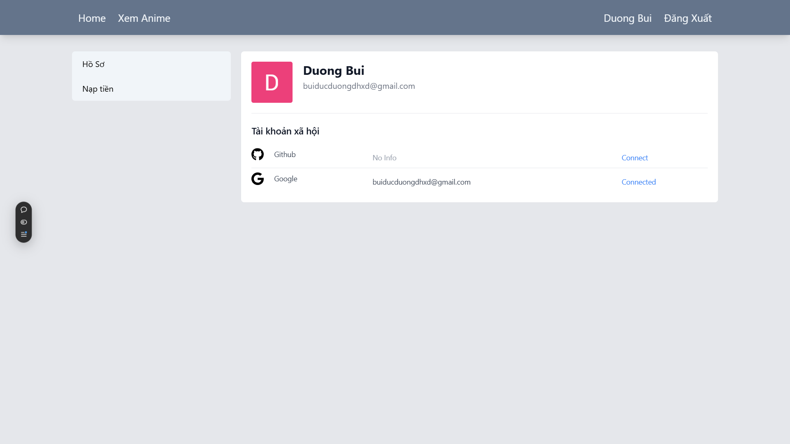
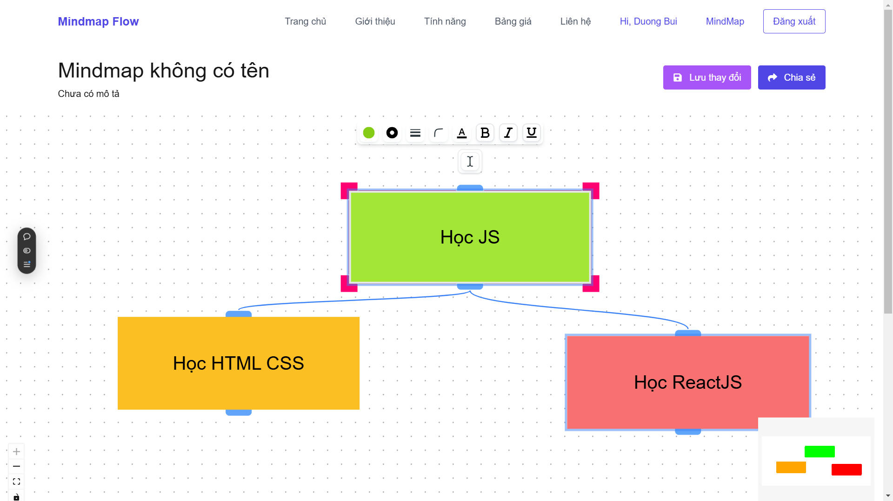

# F8-Nextjs

- Đây là một Repository chứa các bài tập trong quá trình học NextJs của tôi:

- Bao gồm các bài tấp
- lesson01: Portfolio
  - Học về: i18n, dark-mode, 
  - [Demo](https://f8-nextjs-c9b5.vercel.app/vi) 
  - [Source Code](./lesson01/)

- Lesson02: Sell Course online
  - Next Auth, đăng nhập bằng github + google
  - [Demo](https://f8-nextjs-64ml.vercel.app/) 
  - [Source Code](./lesson02/)

- Lesson03: Ứng dụng Mindmap - Bài tập cuối block. 
  - Làm việc với thư viện `@xyflow/react`
  - [Demo](https://f8-mindmap.vercel.app/) 
  - [Source Code](./lesson02/)

# Một số hình ảnh nổi bật

## Lesson02: Sell Course online

- 

## Lesson03: Mindmap

- 